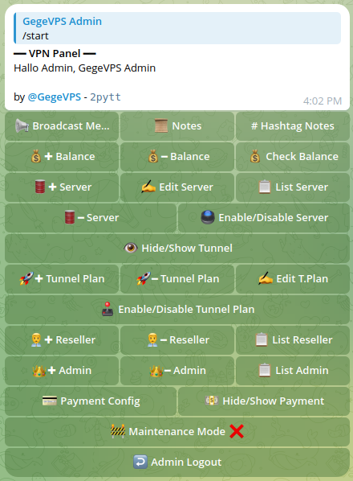
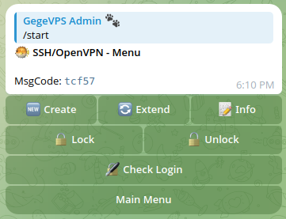

# VPN Telegram Panel - Documentation
<p align="center">
	<a href="https://t.me/gegevps_tunnel_bot"><b>LIVE PREVIEW DEMO</b></a>
</p>

### Overview

<p align="center">
  
  
</p>
<p align="center">
  
</p>

### Installation

1. Install Docker Container on your server. [Follow the tutorial here](https://docs.docker.com/engine/install/)
2. Clone this Repository
	```bash
	git clone https://github.com/GegeDevs/vpnpanel-docs.git ./vpnpanel
	```
3. Use one of these two options
	```bash
	cd ./vpnpanel/config
	```
4. Edit `config.yaml`
	| TAG | Instruction |
	|--|--|
	| `<BOT_TOKEN>` | replace with yout bot token from [botFather](https://t.me/BotFather) |
	| `<BOTNOTIF_TOKEN>` | replace with yout bot token from [botFather](https://t.me/BotFather) |

5. Start Docker Compose
	```bash
	sudo docker compose up -d
	```

6. Test `/start` on your bot

### Register VPS IP Address for Access [FREE]

Register your VPS IP Address to this bot [GegeVPS AutoScript](https://t.me/GegeVPS_AutoScript_bot). There is a plan for one day every day. You can use it to test the bot's connection to the server.

### Features

 - [x] Pluginable for Supporting many VPN Server Script 
 - [x] Supports Multiple tunnel types
 - [x] Admin Panel Dashboard for Centralize Configuration
 - [x] Broadcast Message to All Client
 - [x] Editable Start Notes
 - [x] Notes for each Tunnel Menu
 - [x] Hashtag Notes
 - [x] Add, Reduce, Check Balance Manual
 - [x] Add, Delete, and List Server
 - [x] Enable/Disable Server
 - [x] Add, Delete, Edit Tunnel Plan
 - [x] Enable/Disable Tunnel Plan
 - [x] Hide/Show Tunnel Type
 - [x] Add, Remove, and List Reseller
 - [x] Add, Remove, and List Admin
 - [x] Maintenance Mode Toggler
 - [x] Hide/Show Payment Gateway
 - [x] Payment Configuration
 - [x] Hide/Show Payment Method
 - [x] Auto Deposit with Payment Gateway [`Tripay`]
 - [x] Auto Deposit with Payment Gateway [`OkeConnect`/`OrderKuota`]

*TODO...*
 - [ ] Auto Deposit with Paypal
 - [ ] Auto Deposit with Midtrans

### Tunnel Supported
| Tunnel | Code | Action Locally | Action Remotely |
|--|--|--|--|
| SSH/OpenVPN | `sshovpn` | `info` | `create`, `extend`,<br/>  `delete`, `checklogin`,<br/> `lock`, `unlock` |
| SoftetherVPN | `sevpn` | `info` | `create`, `extend`,<br/> `delete`, `checklogin`,<br/> `lock`, `unlock` |
| VMess | `vmess` | `info` | `create`, `extend`,<br/> `delete`, `checklogin`,<br/> `lock`, `unlock` |
| VLess | `vless` | `info` | `create`, `extend`,<br/> `delete`, `checklogin`,<br/> `lock`, `unlock` |
| Trojan | `trojan` | `info` | `create`, `extend`,<br/> `delete`, `checklogin`,<br/> `lock`, `unlock` |
| Shadowsocks | `ssocks` | `info` | `create`, `extend`,<br/> `delete`, `checklogin`,<br/> `lock`, `unlock` |
| Socks5 | `socks5` | `info` | `create`, `extend`,<br/> `delete`, `checklogin`,<br/> `lock`, `unlock` |

| Action | Details |
|--|--|
**`create` | Used to create tunnel accounts
**`extend` | Used to extend the active period of a tunnel account
*`info` | Check account details based on bot database
**`delete` | Delete user account on server
**`checklogin` | Check user login on server
**`lock` | Lock tunnel account
**`unlock` | Unlock tunnel account

> *Locally : *No connection to server required*<br>**Remotely : *Requires connection to server*

### Bash Executioner

File PATH

```bash
/etc/gegevps/bin/telegram-<CODE>-<ACTION>.sh <USERNAME> <PASSWORD> <DAYS>
```

*example*: 

```bash
# VMess Create Account
/etc/gegevps/bin/telegram-vmess-create.sh gegeuser gegepass 30
```
